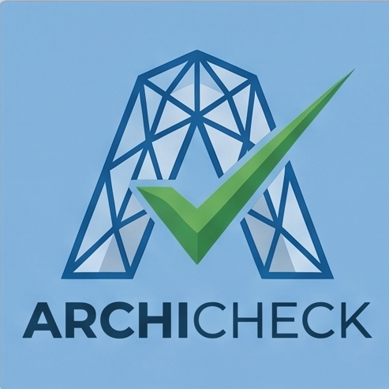
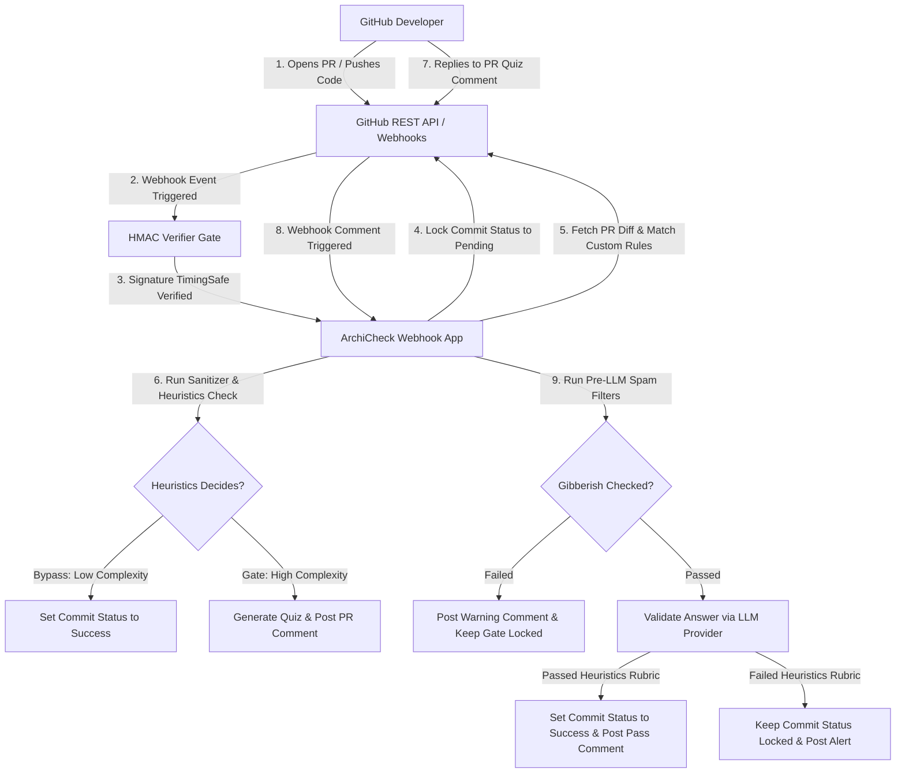

# 🛡️ ArchiCheck

<p align="center">
  
</p>

> **The Cognitive Control Plane for Human-First Software Engineering.**
> Gating pull requests behind interactive architectural quizzes to combat passive "rubber-stamping," preserve developer agency, and prevent systemic deskilling in the age of AI.

---

## 🔍 The Problem

Modern software development is experiencing a subtle but profound socio-technical shift. The rise of AI code generation tools has dramatically accelerated output velocity, but it has also introduced a critical vulnerability: **cognitive bypass**. 

When developers delegate code generation to AI assistants, they frequently review the output with passive, low-effort cognitive engagement. This leads to **"rubber-stamping"**—approving complex, multi-layered code changes without a deep conceptual model of the architecture. Over time, this behaviors generates:
*   **Systemic Deskilling:** The gradual erosion of human engineering intuition, problem-solving capacity, and system understanding.
*   **Architecture Drift:** Silent accumulation of structural complexity and mismatched patterns that humans fail to critique in real time.
*   **Accountability Debt:** Gaps in system ownership where developers are unable to maintain, debug, or justify code they "wrote" but do not comprehend.

---

## 🎯 The Solution & Features

ArchiCheck applies **Design Thinking** to the pull request lifecycle, transforming code verification from a passive checklist into an active, human-first learning gate. 

Instead of treating developer verification as a purely administrative task, ArchiCheck introduces friction back into the workflow at strategic moments of complexity. This encourages developers to step out of "System 1" automatic processing and engage their "System 2" deliberate reasoning before code enters the main branch.

### 🚀 Key Features

*   **Active Cognitive Gating:** Dynamically assesses incoming Git diffs for complexity and AI-reliance cues. If complexity exceeds system thresholds, it locks the PR commit status and generates interactive, language-agnostic architectural comprehension quizzes directly in the PR thread.
*   **Automatic Secret & Privacy Sanitizer:** Utilizes ECMAScript regex lookbehinds and protective execution limits to redact sensitive items (such as AWS credentials, Google API keys, or Slack bot tokens) from code diffs before transmitting data to external LLMs, protecting repository secrets from context window exposure.
*   **Free-Tier Developer Sandbox (Local AI Playground):** Offers a stateful, offline playground featuring a custom-built, React-based "Pipeline Thread" UI. Developers can locally seed mock scenarios, test answers, view separate prompt/generation token telemetry, and debug evaluate rubrics locally without live GitHub webhook connections.
*   **Edge-Ready Asynchronous Lifecycles:** Features an intelligent background execution manager that leverages serverless `waitUntil` hooks on Edge runtimes, or falls back to an in-memory queue with graceful termination hooks on standalone container runtimes to prevent thread loss during container restarts.
*   **Pre-LLM Deterministic Guardrails:** Uses high-efficiency, pre-LLM check filters to reject obvious keyboard mashing, spam answers, or duplicate letter strings instantly, saving API token quotas and giving developers immediate local warning badge feedback.

### 🏗️ High-Level Solution Design



---

## 🧠 The Human-First-AI Framework

ArchiCheck is designed in accordance with the **Human-First-AI Framework** (as detailed at [humanfirstengineering.dev](https://humanfirstengineering.dev)). Rather than aiming to automate the developer out of the system, ArchiCheck utilizes AI to enhance human agency, cognitive responsibility, and knowledge retention.

### 📐 Scoping Process & Problem Framing
We enforce a strict, documentation-driven **Scoping Process** before any code is committed. Every proposed epic, feature, or tool begins with a rigorous system scoping report mapping out target outcomes, boundaries, user friction points, and failure domains. This keeps technical debt quarantined and guarantees that development remains aligned with human accessibility needs.

### 👮 High-Level AI-Agent Governance
ArchiCheck executes within a bounded, declarative **AI-Agent Governance** framework. Autonomous agents are prohibited from making unverified mutations or side-effects. All security boundaries, mock stubs, and pipeline caching structures are locked under strict execution schemas, ensuring that AI agents act as auxiliary partners while humans maintain architectural authority.

---

## 🧪 The Experiment: AI-Scrum

ArchiCheck represents a live experiment in **"AI-Scrum"**—running autonomous, stateful AI agent teams within the operational cadence of high-performing human engineering teams.

*   **Cadence & Sprints:** Agents operate within structured sprint windows. Sprints feature flexible timelines, adjusting dynamically to accommodate complex scoping needs, manual code audits, or system validation cycles.
*   **Rigorous Continuous Improvement:** Each iteration concludes with a brutal, honest retrospective mapping out what went wrong, identifying AI hallucination modes, and recording technical blockers.
*   **Human-in-the-Loop Reviews:** Agent-generated plans, schema changes, and pull requests must undergo human review gates. This pairing of agentic execution with human oversight ensures quality and system safety at scale.

---

## 📚 Documentation

For deep-dives into the architecture, security models, policies, testing gates, and development procedures of ArchiCheck, refer to the **[ArchiCheck Documentation Index](./docs/README.md)**.

The index maps the entire documentation layout:
*   **[Architecture & Design](./docs/Architecture/ADRs.md):** Architectural Decision Records (ADRs), API Contracts, and environment diagrams.
*   **[Security & Threat Models](./docs/Security/Threat_Model.md):** STRIDE threat modeling, vulnerability registers, and sandbox reviews.
*   **[Applied AI Policies](./docs/Applied-AI/Safety_and_Hallucination_Test_Plan.md):** Model safety settings, prompt engineering guidelines, and gibberish mitigations.
*   **[Project Management](./docs/PM/Product_Backlog.md):** Sprint reports, Scrum backlogs, risk registers, and state tracking.
*   **[Testing & Release Gates](./docs/Testing-And-Release-Gates/Test_Plan.md):** Vitest rules, Playwright integrations, and manual UAT test checklists.

---

## ⚙️ Quick Start

### Prerequisites
*   Node.js (v20+ recommended)
*   An active Upstash Redis database (or local cache mock configuration)
*   A Google Gemini or Vertex AI developer API key (optional, for real provider testing)

### 🛠️ Getting Started

1.  **Clone the Repository:**
    ```bash
    git clone https://github.com/tinhct/archi-check.git
    cd archi-check
    ```

2.  **Install Dependencies:**
    Install dependencies (this will also automatically initialize your `.env.local` file from the `.env.example` template if it is missing):
    ```bash
    npm install
    ```

3.  **Run the Setup Wizard:**
    Configure your local developer environment parameters, BYOK free-tier credentials, and mock configurations:
    ```bash
    npm run setup:keys
    ```

4.  **Run in Development Mode:**
    Start the local Next.js development server:
    ```bash
    npm run dev
    ```

5.  **Run the Test Suite:**
    Validate your configuration with the automated unit and integration tests:
    ```bash
    # Run the full test suite
    npm run test:run
    
    # Run tests in watch mode
    npm run test
    
    # Run Playwright E2E simulation tests
    npm run test:e2e
    ```

### ⚙️ Repository Configuration (`.archicheck.yml`)

To customize complexity thresholds, exclude paths, or configure AI-reliance ratios, add a `.archicheck.yml` configuration file to the root of your repository.

> [!IMPORTANT]
> **Branch Configuration Rule:** ArchiCheck loads repository configurations dynamically from the head commit of the incoming pull request. Therefore, **any custom rules or modifications to `.archicheck.yml` must be committed and pushed directly to your feature branch** (the branch you are opening the PR from) for the system to apply them to your evaluation.

---

## 💬 Frequently Asked Questions (FAQ)

We maintain a comprehensive, plain-English **[Frequently Asked Questions Guide](./docs/FAQ.md)** covering:
*   **Algorithmic Gating & Metrics:** How complexity scoring and the "Spray & Pray" velocity filters are calculated.
*   **Security & Data Privacy:** Outbound secrets redaction, HMAC timing-safe webhook verification, and Vercel Edge middleware access rules.
*   **Integrations & AI:** How the fail-open resiliency policies, timeout gates, and administrative slash bypass commands operate under outage conditions.
*   **Local Playground Sandbox:** How the offline two-stage evaluation pipeline and per-question textboxes work.

Refer to the **[FAQ Guide](./docs/FAQ.md)** for complete details on onboarding, limitations, and customization options.

---

## 📄 License

ArchiCheck is open-source software released under the [MIT License](./LICENSE).
