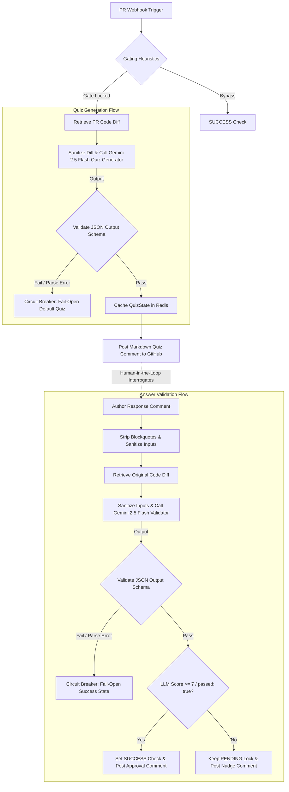

# AI & Agentic Workflow Design

**Last Updated:** 2026-07-08

## 🤖 System Logic & Agent Loops

## ⚙️ Core Components

* **Primary AI Paradigm:** Gated Cognitive Loop (Synchronous blocking + Asynchronous background LLM generation and evaluation checks).
* **Knowledge Sources:** Raw Git unified diff payload fetched from GitHub REST API.
* **State Management:** Cached key-value `QuizState` objects stored in Upstash Redis database, mapping `prId` to the active quiz structure, author username, and verification states.
