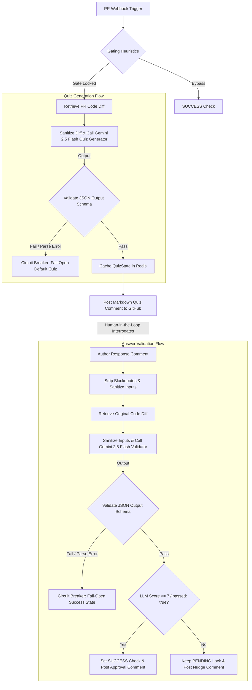
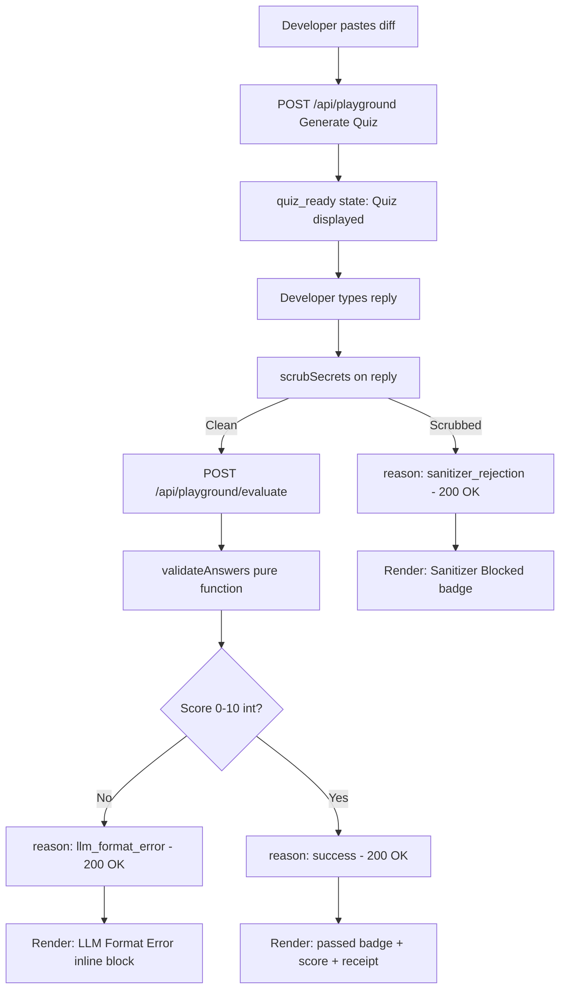

# AI & Agentic Workflow Design

**Last Updated:** 2026-07-12

## 🤖 System Logic & Agent Loops

## ⚙️ Core Components

* **Primary AI Paradigm:** Gated Cognitive Loop (Synchronous blocking + Asynchronous background LLM generation and evaluation checks).
* **Knowledge Sources:** Raw Git unified diff payload fetched from GitHub REST API.
* **State Management:** Cached key-value `QuizState` objects stored in Upstash Redis database, mapping `prId` to the active quiz structure, author username, and verification states.

---

## 🧪 Local AI Playground — Phase 2 Evaluation Loop (AC-ST-501-P2)

**Added:** 2026-07-12

**Key Design Principles:**
- **Strict Parity:** Playground calls production `validateAnswers` directly. No sandbox prompt variant.
- **Stateless Evaluate Endpoint:** Full context (`diff`, `quizJson`, `reply`) travels in each POST body. No session storage.
- **Sanitizer as First Gatekeeper:** `scrubSecrets` runs on `reply` before any LLM call. Rejections return shaped 200 OK (not HTTP 400) to provide developer-friendly feedback during injection testing.
- **Passing Threshold:** Score ≥ 7 / 10 is treated as a passing result. Threshold is hardcoded as a system constant (`passingThreshold: 7`) returned in all responses.
