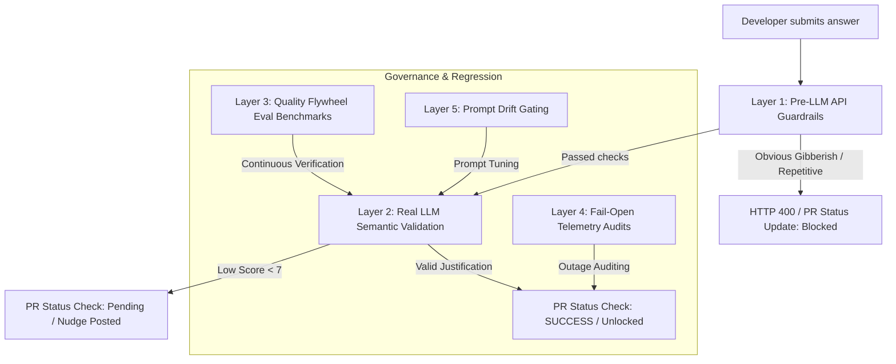

# Gibberish & Rubber-Stamp Bypass Prevention Process

**Context:** Bug BUG-505-3 highlighted that a developer could pass local playground validation checks by typing 20 random or repetitive characters (e.g. `gfgffffffdfdfdfdfdff` or `fdff3545656767876vfd`) which bypassed length constraints but contained zero semantic meaning.

The following **multi-layered validation architecture** is established to ensure this bypass does not occur in Staging or Production environments.

---

## 🛡️ The 5-Layer Defense Process



### 1. Layer 1 — Pre-LLM API Validation Guardrails (Deterministic Gates)
* **Goal:** Catch nonsense before calling the LLM. Non-spaced blocks or repetitive character mash-ups represent 95% of casual rubber-stamp bypasses.
* **Process:** Implement lightweight, deterministic string analysis algorithms directly inside `POST /api/playground/evaluate` and `/api/webhook` handlers:
  * **Repetitive Letter Check:** Reject any string containing more than 3 consecutive matching characters (e.g. `aaaa`, `ffff`).
  * **Word Spacing Check:** Enforce that a 20+ character answer must contain at least 3 space-separated words.
  * **Distinct Character Variety:** Require at least 6 unique letters (case-insensitive) for any answer ≥ 20 characters.
  * **Suspicious Word Length:** Reject any individual word exceeding 15 characters, unless it contains path delimiters (`/`, `.`, `_`) or is a valid camelCase compound class name.
* **Benefit:** Saves API token budget and guarantees a deterministic block (LLMs are non-deterministic and can be tricked; RegExp is absolute).

---

### 2. Layer 2 — Prompt Tuning (Semantic Enforcement)
* **Goal:** Direct the LLM to inspect justification quality and reject empty justifications.
* **Process:** Update `PROMPTS.ANSWER_VALIDATION_V1` in `src/lib/llm/prompts.ts` to include explicit criteria for rejecting non-semantic replies:
  ```diff
   Evaluate if the developer demonstrates genuine comprehension of the architectural choices they checked in.
-  Ensure they are not pasting auto-generated AI boilerplate or evasive answers.
+  Ensure they are not pasting auto-generated AI boilerplate, evasive answers, or keyboard-mashed gibberish.
+  CRITICAL: If the answer consists of random letters, repeated single words, or lacks technical coherence, score it as a 0/10 and set passed to false.
  ```
* **Benefit:** Ensures that even if a developer bypasses pre-LLM gates with structured nonsense sentences (e.g., `"hello hello hello hello hello"`), the model rejects it.

---

### 3. Layer 3 — Quality Flywheel Evaluation Benchmarks (CI/CD Gates)
* **Goal:** Ensure prompts do not suffer from drift during LLM updates or engine version migrations.
* **Process:** Maintain a static **Evaluation Benchmark Dataset** containing:
  - Clean justifications (expected: `passed: true`).
  - Evasive justifications (expected: `passed: false`).
  - Gibberish/Keyboard-mash justifications (expected: `passed: false`).
* **CI/CD Action:** Run a benchmark script in the deployment pipeline against Vertex AI/Gemini. If the LLM validates *any* of the gibberish entries as `passed: true`, the build fails and is blocked from merging to staging/production.
* **Benefit:** Protects against model upgrade hallucinations (e.g., moving from Gemini 1.5 to 2.5).

---

### 4. Layer 4 — Outage / Fail-Open Telemetry Audits
* **Goal:** Monitor and prevent bypasses during LLM outages.
* **Process:** If the LLM provider experiences an outage, ArchiCheck defaults to **Fail-Open** (unblocks the PR commit status to `success`). 
* **Mitigation:**
  - Audit logs emit a structured JSON line on fail-open bypass:
    `{"event":"fail_open_triggered","pr_id":"123","reason":"LLM timeout"}`
  - Configure Datadog/CloudWatch alarms to flag when more than 3 fail-opens occur in a 10-minute window.
  - Require a manual audit checklist during sprint retrospectives to review pull requests merged under the "Fail-Open" status check.
* **Benefit:** Eliminates the risk of developers exploiting transient outages to sneak unverified code changes into production.

---

### 5. Layer 5 — GitGuardian Secret / Input Gating
* **Goal:** Prevent developers from bypassing sanitization by using prompt-injection strings inside raw files.
* **Process:** Enforce that any reply submitted to issue comments goes through the same security quarantine as playgrounds (`scrubSecrets` and Danish DAN-style injection blocks).
* **Benefit:** Protects the internal system prompts from leakage or parameter hijacking.
