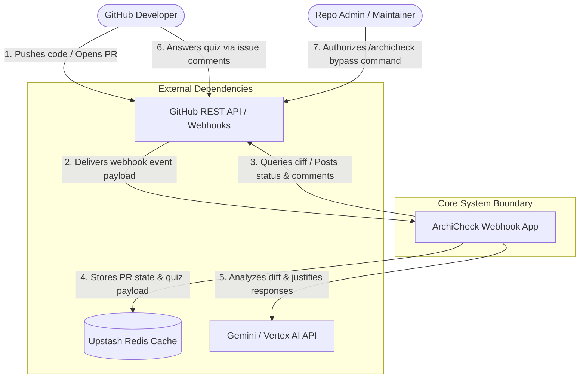

# System Context (C4 Level 1)

**Last Updated:** 2026-07-08

## 🌍 System Landscape

## 🧩 Context Descriptions

| Entity | Type | Description / Responsibilities |
| :---- | :---- | :---- |
| **GitHub Developer** | Person | Code contributor who submits pull requests and answers generated quiz questions. |
| **Repo Admin / Maintainer** | Person | Authorized administrator who can bypass interrogation gates during emergencies. |
| **ArchiCheck Webhook App** | Software System | The core Next.js Edge app that handles webhooks, evaluates heuristics, coordinates LLMs, and manages persistences. |
| **GitHub REST API / Webhooks** | External System | GitHub provider delivering event triggers (HMAC signed) and receiving status checks/comments. |
| **Upstash Redis Cache** | External System | Fast key-value persistence store used to cache active `QuizState` payloads with a 1,000ms SLA timeout. |
| **Gemini / Vertex AI API** | External System | Enterprise AI endpoint used to generate architectural questions and validate developer answers. |
