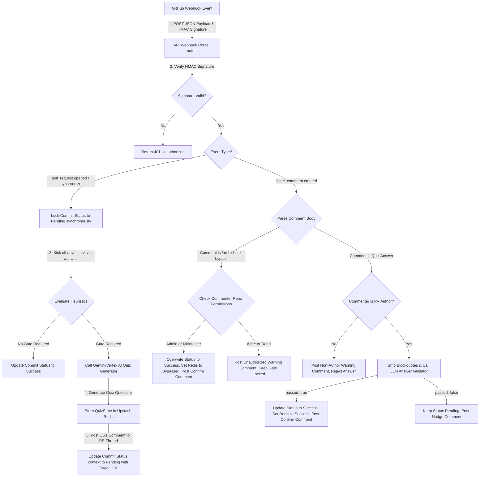

# System Data Flow

**Last Updated:** 2026-07-08

## 🗺️ Data Flow Visualization

## 🗄️ Data Entities & Storage

| Entity | Source of Truth | Storage Mechanism | Data Classification (Public/Sensitive) |
| :---- | :---- | :---- | :---- |
| **HMAC Signature** | GitHub App Registration Configuration | Vercel Environment Variables (`GITHUB_WEBHOOK_SECRET`) | Sensitive (Restricted credentials) |
| **API Keys / Service Account** | GCP / Vertex AI Console | Vercel Environment Variables (`GEMINI_API_KEY`, `GOOGLE_CREDS_JSON`) | Sensitive (Restricted credentials) |
| **PR Quiz State** | Webhook Router Execution | Upstash Redis State Cache (`archicheck:pr:{prId}`) | Sensitive (Internal development state logs) |
| **PR Source Diff** | GitHub Pull Request | GitHub REST API (`application/vnd.github.v3.diff` formats) | Sensitive (Proprietary source code) |
| **Evaluation Rules** | Repository Root | Repo Config File (`.archicheck.yml`) | Public / Internal (Dev configs) |
