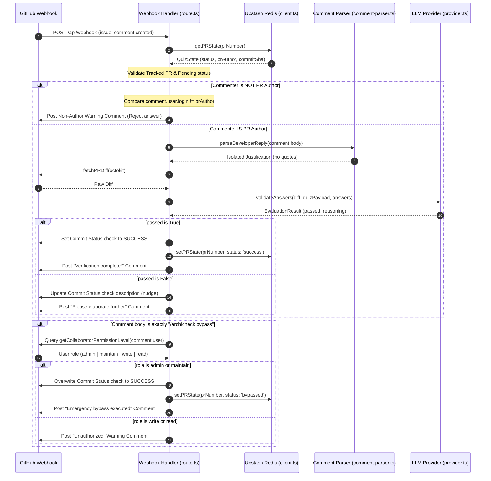

# Feature Name
Interactive Interrogation Gate & Emergency Bypass (Sprint 3)

# Business Context & Value
Once a pull request is locked behind a Pending status check, the developer must justify their architectural decisions directly in the PR thread. ArchiCheck ingests these responses, strips out email/web quoted lines, validates reasoning against the LLM, and unblocks the PR if successful. To ensure production hotfixes are never delayed during outages, the system provides a slash command (`/archicheck bypass`) that allows authorized team members (Admins/Maintainers) to execute an immediate audit-logged bypass.

# Architecture Diagram


# Architecture & Components
* **Webhook Router** ([route.ts]../../../src/app/api/webhook/route.ts): Orchestrates event parsing, role authorizations, state checks, and routes comments to validation/bypass workflows.
* **Comment UI Generator** ([comments.ts]../../../src/lib/github/comments.ts): Formats feedback and warning Markdown comment blocks posted to GitHub issues.
* **Reply Parser** ([comment-parser.ts]../../../src/lib/github/comment-parser.ts): Filters lines starting with `>` to remove quotes and isolate new reply text.
* **LLM Validator** ([provider.ts]../../../src/lib/llm/provider.ts): Sends the isolated reply, original diff, and generated questions to the LLM for evaluation.

# Data Model Changes
* Updated `QuizState` type definition in [archicheck.d.ts]../../../src/types/archicheck.d.ts) to store author info and bypass reasons:
  ```typescript
  export interface QuizState {
    prId: number;
    commitSha: string;
    prAuthor: string; // The username of the PR author
    status: QuizStatus; // 'pending' | 'success' | 'failed' | 'bypassed'
    quizPayload: QuizPayload;
    userAnswers?: string[];
    validatedAt?: string;
    bypassReason?: string;
  }
  ```

# Agent Implementation Steps
* **Phase 1:** Add `prAuthor` field to `QuizState` interface and save it during PR opened event caching.
* **Phase 2:** Implement reply parser blockquote stripper and test via Vitest unit tests.
* **Phase 3:** Update prompts and webhook routers to handle comment replies, authorize bypass roles, overwrite commit statuses, and verify via integration test suites.

# Security & Performance Risks
* **Unauthorized Gating Overrides**: Malicious actors trying to force-approve status checks. Mitigated by verifying commenter usernames against the saved `prAuthor` for quiz answers, and querying the GitHub Collaborators API to restrict `/archicheck bypass` strictly to `admin` or `maintain` roles.
* **API Rate Limits during Outages**: Permission checks execute a GET request. Mitigated by restricting permission queries only when a command starting with `/archicheck bypass` is parsed, avoiding calls on standard discussion comments.

# Acceptance Criteria
* Rejects quiz responses from commenters who are not the pull request author, posting a canned warning reply.
* Parses responses to strip out markdown blockquotes, isolating the new text.
* Sends parsed responses to the LLM under language-agnostic intent rules (evaluating technical accuracy only).
* Intercepts `/archicheck bypass` case-insensitive commands.
* Approves the gate and overwrites status description to `"⚠️ Emergency bypass executed by Tech Lead."` if the commenter is an Admin or Maintainer on the repo.
* Rejects bypass requests with warning replies if the commenter does not have administrative permissions.
