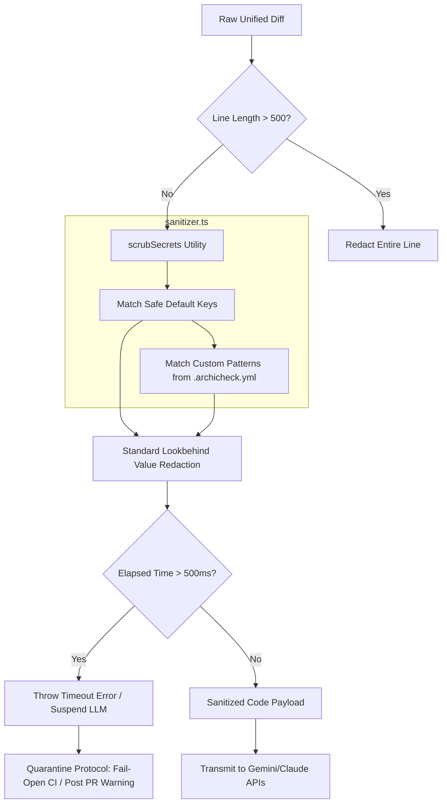

# Feature Name
Payload Sanitization & Secret Scrubbing (Story 2.2)

# Business Context & Value
ArchiCheck integrates with external third-party LLM APIs (like Anthropic Claude or Google Gemini) to generate interactive architectural quizzes. To comply with enterprise privacy policies, Vietnamese/EU data governance regulations, and security best practices, we must absolutely guarantee that no proprietary secrets, API keys, private credentials, or passwords embedded within developer diffs are leaked to external APIs. The sanitization pipeline scrubs sensitive patterns before any payload is compiled or transmitted.

# Architecture Diagram


# Architecture & Components
* **Sanitization Utility** ([sanitizer.ts]../../../src/lib/security/sanitizer.ts): Core lookbehind regular expression matching engine. Incorporates a 500-character line shield and a 500ms execution timer.
* **YAML Config Loader** (integrated in API webhook): Loads `.archicheck.yml` using the standard `yaml` package and extracts `custom_secret_patterns` to merge with default patterns.
* **Fixture Test Suite** ([sanitizer.test.ts]../../../tests/unit/sanitizer.test.ts): Unit tests verifying lookbehind variable redacts, safe non-secret passes, and 500ms CPU timeout triggers when encountering ReDoS backtracking.

# Data Model Changes
* `.archicheck.yml` configuration schema:
  ```yaml
  custom_secret_patterns:
    - "MY_PREFIX_[a-zA-Z0-9]{32}"
  ```

# Agent Implementation Steps
* **Phase 1:** Identify common default secret patterns (AWS keys, Google API keys, Stripe, Slack webhooks, JWTs, PEM blocks, and config assignments).
* **Phase 2:** Build Lookbehind assertions to redact ONLY the credential value in code assignments, leaving variable declarations (`const api_key = `) syntactically valid.
* **Phase 3:** Integrate `yaml` library, enforce 500-character line shields, and implement a post-execution elapsed CPU timer to trigger 500ms circuit breakers. Verify via Vitest.

# Security & Performance Risks
* **Regex ReDoS (Regular Expression Denial of Service)**: Untrusted user-defined patterns can cause exponential backtracking. Mitigated by:
  1. **Line Shield**: Rejecting custom regex evaluations on lines exceeding 500 characters.
  2. **Execution Circuit Breaker**: Aborting processing and throwing an error if total sanitization takes longer than 500ms.
  3. **Quarantine Protocol**: If a timeout is triggered, the LLM call is aborted entirely, status checks fail-open (Success) to avoid blocking builds, and a PR warning is posted.
* **Log Leakage**: Logging credentials during redaction. Mitigated by outputting **strictly formatted JSON metadata logs only** (e.g. event, pr_id, file_path, rule_name), never printing the matched credential.

# Acceptance Criteria
* Replaces AWS Access Keys, Google API keys, Stripe keys, Slack webhooks, JWTs, PEM private keys, and properties.
* Standardizes all replacements to `[REDACTED_SECRET]`.
* Integrates custom regex signatures dynamically from `.archicheck.yml` using standard `yaml` parsing.
* Limits custom regex execution to lines $\le 500$ characters.
* Aborts processing if execution exceeds 500ms (ReDoS defense) and triggers the quarantine workflow.
