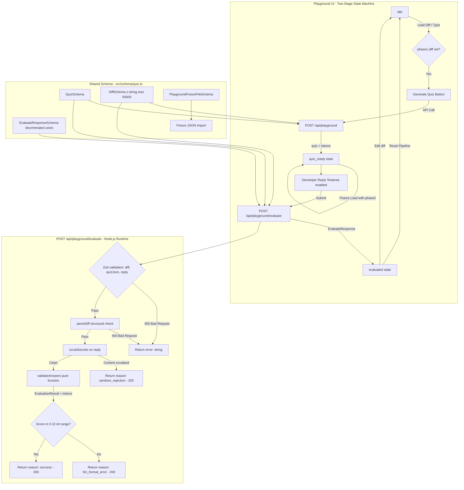

# Feature Name
Local AI Playground — Phase 2: Two-Stage Evaluation Pipeline (Story AC-ST-501-P2)

# Business Context & Value
Phase 1 of the Local AI Playground gave developers a one-way quiz generator (diff → quiz). Phase 2 adds the evaluation loop, allowing developers to locally test both AI pipeline phases — quiz generation AND reply grading — in a single interactive UI without triggering real GitHub webhooks. This enables prompt engineers to iterate on `validateAnswers` in minutes rather than hours.

# Architecture Diagram



# Architecture & Components

* **State Machine** (`src/app/playground/page.tsx`): Three-phase React state machine (`idle → quiz_ready → evaluated`). Strict invalidation: any diff change or template load resets all downstream state instantly. Regenerate clears Phase 2 state. Reset Pipeline returns to `idle`.
* **Evaluate Route** (`src/app/api/playground/evaluate/route.ts`): Stateless Node.js HTTP handler. Validation-first: Zod → parseDiff → scrubSecrets → validateAnswers. Returns discriminated union response. Blocked in production via `notFound()`.
* **Shared Schema** (`src/schema/quiz.ts`): Single source of truth for `QuizSchema`, `DiffSchema`, `EvaluateResponseSchema`, and `PlaygroundFixtureFileSchema`. Both playground routes import from this file.
* **Pure LLM Function** (`src/lib/llm/provider.ts#validateAnswers`): Confirmed pure (zero Redis/Octokit side effects). Updated return type includes `tokens: { input, output, total }` after AC-ST-504.
* **Fixture System** (`src/lib/mocks/fixtures/playground-fixtures.json`): Version-locked JSON fixture file. Statically imported in development/test. Webpack-excluded from production bundle.

# API Contract

## `POST /api/playground/evaluate`
**Runtime:** Node.js (explicit `export const runtime = 'nodejs'`)
**Production gate:** `notFound()` when `NODE_ENV === 'production'`

**Request Body:**
```json
{
  "diff": "string (max 50,000 chars, valid unified diff format)",
  "quizJson": "Quiz[] (max 20 items, validated against QuizSchema)",
  "reply": "string (max 10,000 chars)"
}
```

**HTTP 400 Response** (structural validation failures):
```json
{ "error": "Human-readable error message." }
```

**HTTP 200 Response — Discriminated Union (3 variants):**
```typescript
// Variant 1: success
{ reason: "success", passed: boolean, score: number, reasoning: string, passingThreshold: 7, tokens: { input: number, output: number, total: number } }

// Variant 2: sanitizer_rejection
{ reason: "sanitizer_rejection", passed: false, score: null, reasoning: string, passingThreshold: 7, tokens: { input: 0, output: 0, total: 0 } }

// Variant 3: llm_format_error
{ reason: "llm_format_error", passed: false, score: null, reasoning: string, passingThreshold: 7, tokens: { input: number, output: number, total: number } }
```

# Data Model Changes

* **NEW:** `src/schema/quiz.ts` — Shared Zod schemas for both playground routes.
* **BREAKING CHANGE:** `POST /api/playground` response: `tokenCost: string` → `tokens: { input: number, output: number, total: number }`. Affects `route.ts` and `route.test.ts`.
* **NEW:** `src/app/api/playground/evaluate/route.ts` — Phase 2 evaluate endpoint.
* **UPDATED:** `EvaluationResult` type in `src/types/archicheck.ts` — adds `tokens: { input, output, total }` field (after AC-ST-504 merges).
* **NEW:** `src/lib/mocks/fixtures/playground-fixtures.json` — Versioned fixture file.
* **UPDATED:** `next.config.ts` — Webpack exclusion for `src/lib/mocks/` in production.

# Security & Performance Considerations

* **Information Disclosure:** Fixture file containing adversarial payloads is webpack-excluded from production bundle. Middleware also blocks the playground routes in production (defense-in-depth).
* **ReDoS Prevention:** Zod validation (O(1) size checks) runs BEFORE `parseDiff()` (regex-based). Oversized payloads are rejected before expensive parsing begins.
* **Quota Protection:** Reply field capped at 10,000 chars. Quiz array capped at 20 items. Diff capped at 50,000 chars. Prevents accidental context window exhaustion.
* **Prompt Injection Defense:** `scrubSecrets` applied to `reply` field before LLM evaluation call. Sanitizer rejection returns shaped 200 (not 400) to provide pedagogical feedback to developers testing injection vectors.
* **Parity Guarantee:** Playground evaluate route calls the exact same `validateAnswers` production function. No sandbox-variant prompt. No synthetic prompt modifications beyond the hardcoded context values (`repoName: 'local-sandbox'`, `prAuthor: 'local-dev'`).

# Acceptance Criteria Reference
See `docs/PM/Product_Backlog.md` story AC-ST-501-P2 for the full 7-point acceptance criteria list.
