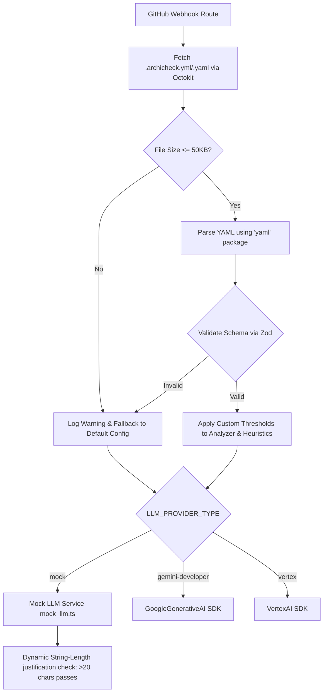

# Feature Name
Repository Customization & Developer Experience (DX) (Epic 4)

# Business Context & Value
To enable seamless local contribution workflows without incurring API costs, and to allow repository maintainers to customize ArchiCheck’s threshold logic to align with their team's engineering maturity.

# Architecture Diagram


# Architecture & Components
*   **`.archicheck.yml` / `.archicheck.yaml`**: The repository-level YAML configuration file allowing customization of gating rules.
*   **`mock_llm.ts`**: The Local Mock LLM Service that implements the `LLMProvider` interface and intercepts queries to execute offline evaluations based on user answer length.
*   **Provider Factory (`provider.ts`)**: Generates instances of Gemini, Vertex, or Mock provider depending on environment variables.
*   **Config Service (`config.ts`)**: Handles sequential remote fetching, size validation, parsing, and deep Zod schema merging.

# Data Model Changes
No new databases are added. The config structure parses into:
```typescript
interface ArchicheckConfig {
  lines_added_threshold: number;       // Default: 300
  algorithmic_complexity_score: number; // Default: 5
  ai_reliance_ratio: number;           // Default: 0.7
  excluded_paths: string[];            // Default: ['**/node_modules/**', 'package-lock.json']
}
```

# Agent Implementation Steps
*   **Phase 1: Mock LLM Service**
    *   Build `src/lib/llm/mock_llm.ts` returning schema-compliant mock responses.
    *   Implement string-length dynamic heuristics (answers >20 characters pass; otherwise fail/nudge).
    *   Refactor `provider.ts` to implement the `mock` provider selection.
    *   Update `src/config/env.ts` with a discriminated union to strictly reject `mock` in production.
*   **Phase 2: Configuration Parser**
    *   Implement sequential fetch utility (`.yml` first, then fallback to `.yaml` if 404, fallback to default if both 404).
    *   Add 50KB check constraint to protect against DoS.
    *   Build YAML parser and Zod validation defaults merger.
    *   Inject config properties into `heuristics.ts` and directory analyzer filters.

# Security & Performance Risks
*   **DoS via Large Configurations**: Blocked by the strict 50KB file size check.
*   **Production Mock Bypass**: Mitigated by Zod env schema checks which throw build errors if `mock` is active when `NODE_ENV === 'production'`.
*   **Outage Fail-Open**: Webhook execution continues with defaults if configuration retrieval or parsing fails.

# Acceptance Criteria
*   Setting `LLM_PROVIDER_TYPE=mock` runs validation in under 50ms locally without calling Gemini.
*   Mock answer evaluation correctly enforces: replies $\le 20$ chars fail with nudge comments, $> 20$ chars pass.
*   Repository configuration files are parsed dynamically and modify gating thresholds.
*   Startup fails fast in production if the mock provider is enabled.
