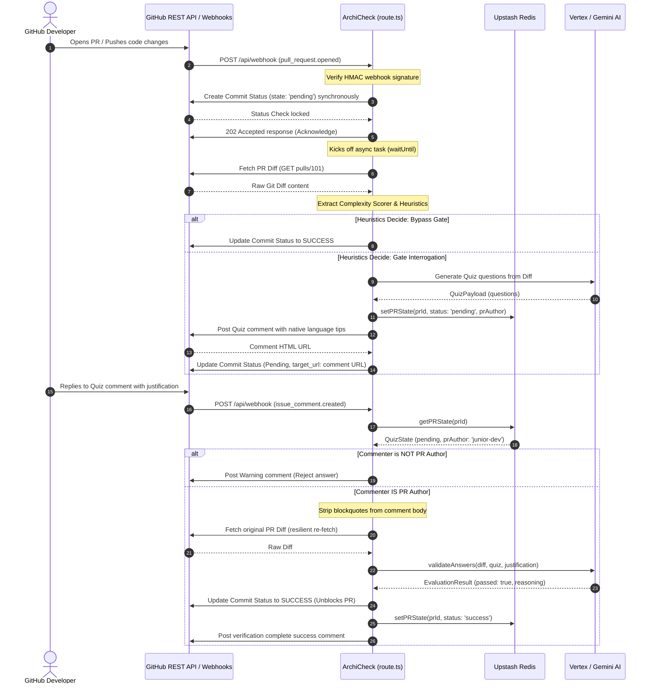
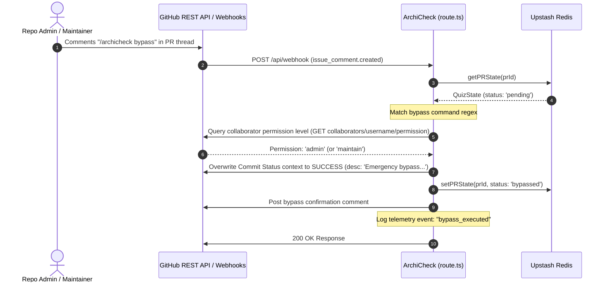

# Core Sequence Diagrams

**Last Updated:** 2026-07-08

## 🔄 Sequence 1: Core Developer Gating & Interrogation Loop

```mermaid
sequenceDiagram
    autonumber
    actor Dev as GitHub Developer
    participant GH as GitHub REST API / Webhooks
    participant Edge as ArchiCheck (route.ts)
    participant Redis as Upstash Redis
    participant LLM as Vertex / Gemini AI

    Dev->>GH: Opens PR / Pushes code changes
    GH->>Edge: POST /api/webhook (pull_request.opened)
    Note over Edge: Verify HMAC webhook signature
    Edge->>GH: Create Commit Status (state: 'pending') synchronously
    GH-->>Edge: Status Check locked
    Edge->>GH: 202 Accepted response (Acknowledge)
    
    Note over Edge: Kicks off async task (waitUntil)
    Edge->>GH: Fetch PR Diff (GET pulls/101)
    GH-->>Edge: Raw Git Diff content
    Note over Edge: Extract Complexity Scorer & Heuristics
    
    alt Heuristics Decide: Bypass Gate
        Edge->>GH: Update Commit Status to SUCCESS
    else Heuristics Decide: Gate Interrogation
        Edge->>LLM: Generate Quiz questions from Diff
        LLM-->>Edge: QuizPayload (questions)
        Edge->>Redis: setPRState(prId, status: 'pending', prAuthor)
        Edge->>GH: Post Quiz comment with native language tips
        GH-->>Edge: Comment HTML URL
        Edge->>GH: Update Commit Status (Pending, target_url: comment URL)
    end
    
    Dev->>GH: Replies to Quiz comment with justification
    GH->>Edge: POST /api/webhook (issue_comment.created)
    Edge->>Redis: getPRState(prId)
    Redis-->>Edge: QuizState (pending, prAuthor: 'junior-dev')
    
    alt Commenter is NOT PR Author
        Edge->>GH: Post Warning comment (Reject answer)
    else Commenter IS PR Author
        Note over Edge: Strip blockquotes from comment body
        Edge->>GH: Fetch original PR Diff (resilient re-fetch)
        GH-->>Edge: Raw Diff
        Edge->>LLM: validateAnswers(diff, quiz, justification)
        LLM-->>Edge: EvaluationResult (passed: true, reasoning)
        Edge->>GH: Update Commit Status to SUCCESS (Unblocks PR)
        Edge->>Redis: setPRState(prId, status: 'success')
        Edge->>GH: Post verification complete success comment
    end
```

## 🔄 Sequence 2: Break-Glass Emergency Bypass Override

```mermaid
sequenceDiagram
    autonumber
    actor Admin as Repo Admin / Maintainer
    participant GH as GitHub REST API / Webhooks
    participant Edge as ArchiCheck (route.ts)
    participant Redis as Upstash Redis

    Admin->>GH: Comments "/archicheck bypass" in PR thread
    GH->>Edge: POST /api/webhook (issue_comment.created)
    Edge->>Redis: getPRState(prId)
    Redis-->>Edge: QuizState (status: 'pending')
    
    Note over Edge: Match bypass command regex
    Edge->>GH: Query collaborator permission level (GET collaborators/username/permission)
    GH-->>Edge: Permission: 'admin' (or 'maintain')
    
    Edge->>GH: Overwrite Commit Status context to SUCCESS (desc: 'Emergency bypass...')
    Edge->>Redis: setPRState(prId, status: 'bypassed')
    Edge->>GH: Post bypass confirmation comment
    Note over Edge: Log telemetry event: "bypass_executed"
    Edge->>GH: 200 OK Response
```
