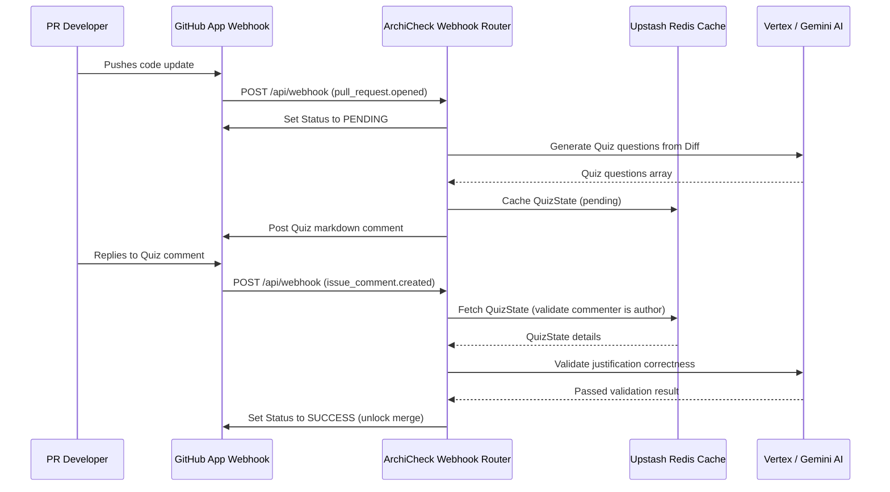

# End-to-End (E2E) Integration Plan

**Last Updated:** 2026-07-08

## 🛤️ Critical Integration Paths

## 🚥 E2E Test Scenarios

| Scenario ID | Flow Description | Required Test Data | Expected Outcome |
| :---- | :---- | :---- | :---- |
| **E2E-01** | PR opened with gated diff triggers quiz comments and Pending commit status. | HMAC signature headers, pull_request.opened JSON payload. | Commit status set to Pending, comment posted. |
| **E2E-02** | Developer responds with valid justification to unlock CI status gate check. | issue_comment.created JSON payload, author matching username. | Commit status set to Success, comment posted. |
| **E2E-03** | Admin user executes `/archicheck bypass` emergency command override. | issue_comment.created JSON payload containing bypass instruction command. | Commit status set to Success, bypass comment posted. |
| **E2E-04** | Redis timeout or unreachable exception handles gate unblocking. | Mock database connection timeout (>1,000ms). | Fail-open Success status unblocks, warning posted. |
