# 🛡️ Guarding the Gate: An Experiment-Sharing Report on AI-Agent Governance & AI-Scrum

Has anyone else been experimenting with strict governance rules for coding agents? How are your autonomous agents faring against the silent thief of 'context amnesia'?

At ArchiCheck, we ran a live experiment in **"AI-Scrum"**—orchestrating a team of autonomous, role-playing AI agents within the structured sprint cadences and rigorous governance of an enterprise software engineering team. This whitepaper details the architectural guardrails, governance boundaries, and state-tracking mechanisms we implemented to transform non-deterministic agent executions into a highly reliable, production-grade delivery pipeline.

---

## ## Phase 1: Project Scaffolding & Setup

Operating autonomous agents in a commercial codebase without strict structural templates is a recipe for codebase drift, fragmented APIs, and broken integrations. We established a strict, documentation-driven **Project Scaffolding** before a single line of feature code was written.

### 📐 Scaffolding & Standardized Document Structure
The repository is divided into two distinct logical zones: the core application codebase (`src/` and `tests/`) and the system documentation plane (`docs/`). To prevent documentation sprawl, the knowledge repository is organized into a deterministic domain map:
*   `docs/Onboarding/`: Getting started manuals and sandbox instructions.
*   `docs/Architecture/`: Architectural Decision Records (ADRs), environment layouts, and topology maps.
*   `docs/Integration/`: Interface contracts and connection specs.
*   `docs/Security/`: STRIDE threat models and vulnerability registers.
*   `docs/Testing-And-Release-Gates/`: Test plans, policies, and quality checklists.
*   `docs/PM/`: Agile backlogs, sprint logs, and active state registers.

Standardized markdown templates (such as `Scoping_Template.md`, `Implementation_Plan_Template.md`, and `Dev_Test_Log_Template.md`) ensure that every requirement, technical plan, and verification log is written with uniform structure, fields, and naming conventions.

### 👥 The Project Committee & Agile Agent Team
Using custom-designed instructions ([`.cursorrules`](file:///Users/tinhct/Documents/AI%20Projects/ArchiCheck%20Project/archi-check/.cursorrules)), we mapped the engineering roles of a cross-functional software team into specific, role-playing AI agent personas. This defines a sequential, multi-agent workflow:
*   **Technical Product Manager (PM / Scrum Master):** Conducts sprint syncs, reads past retrospectives, drafts scoping documents (`Scoping_Template.md` in `/docs/PM/Scoping/`), manages the RAID Log and dependency registers, and refines backlog stories.
*   **Senior Solution Architect:** Conducts Epic Intake & Impact Analysis, designs C4 Context/Sequence diagrams, drafts Architectural Decision Records (ADRs) to capture structural patterns, and aligns planned stories with architectural boundaries.
*   **Senior Security Engineer (DevSecOps):** Conducts STRIDE threat modeling on scoping documents, audits secrets scrubbers, sets API key safety policies, and updates the Secrets Management Plan, Vulnerability Register, and security audit logs.
*   **Tech Lead:** Constructs the deterministic bridge between requirements and code. Drafts step-by-step implementation plans (`Implementation_Plan_[Story-ID].md`), enforces chat-synced approval gates, and regulates execution/deviation rules.
*   **Software Engineer (Developer):** Generates clean, type-safe source code adhering strictly to the Tech Lead's approved implementation steps. Developers are strictly blocked from writing code while the plan status is in "Draft".
*   **Senior QA Engineer (QA Automation):** Enforces a strict three-phase testing protocol (discovery, coverage, capped logging), compiles manual handover E2E test plans (`Manual_Test_[Epic_Name].md`), and manages Quality Gate sign-offs (Go/No-Go checklists).
*   **Product Owner / Technical Writer:** Evaluates user clarity, maintains `/docs/FAQ.md` with plain-English Q&As, and synchronizes the root `README.md` and `/docs/Onboarding/` directories to ensure all onboarding documentation matches the live repository state.

---

## ## Phase 2: AI-Agent Governance & AI-Scrum

To execute work reliably, we adapted standard Agile ceremonies into an automated governance lifecycle called **AI-Scrum**.

### 🔍 Scoping & Framing
Every requirement begins in **Requirement Scoping Governance**. An agent acting as a Technical Product Manager drafts a Scoping Document under `docs/PM/Scoping/`. The agent is **strictly prohibited** from selecting the final technical approach. Instead, they must:
*   Trace the business context and past lessons learned.
*   Provide 2 to 3 distinct candidate approaches with detailed trade-offs.
*   Present these candidates to a human reviewer. 
The human acts as the ultimate authority, selecting the approach and releasing the gate to the next phase.

### 🏃 AI-Scrum in Practice
Agile ceremonies are modified to fit the asynchronous and stateless nature of AI agents:

| Ceremony | Purpose | Gating Mechanism |
|---|---|---|
| **Backlog Refinement** | Refine epic inputs into stories | Backlog updates must link back to an approved Scoping Document. |
| **Sprint Planning** | Define tasks and dependencies | dependency registers are audited; implementation plans are drafted. |
| **Daily Standup / Sync** | Track progress and log blockers | The agent records daily updates in `Active_Agent_State.md`. |
| **Sprint Retrospective** | Audit failures and log lessons learned | Lessons are written to the Sprint Report and fed to the next sprint's scoping prompt. |

### 📂 AI-Scrum Event Artifacts
Each ceremony operates with strict inputs and outputs to preserve the audit trail:
*   **Epic Intake Event:**
    *   *Inputs:* User request, existing architectural maps, lessons learned from past sprints.
    *   *Outputs:* Scoping Document, updated `Product_Backlog.md` with stories and acceptance criteria.
*   **Sprint Planning Event:**
    *   *Inputs:* Selected backlog stories, `Dependency_Register.md`, `RAID_log.md`.
    *   *Outputs:* Drafted `Implementation_Plan_[Story-ID].md`, updated dependencies list.
*   **Daily Standup Event:**
    *   *Inputs:* `Active_Agent_State.md` checklist.
    *   *Outputs:* Updated status checkmarks, logged execution deviations in the Dev Test Log.
*   **Sprint Review/Retrospective Event:**
    *   *Inputs:* Test execution reports, code diffs, manual E2E test plan.
    *   *Outputs:* Signed Go/No-Go Checklist, published git tag, and populated Sprint Retrospective report.

### 📝 Agent Retrospectives & Continuous Improvement
At the end of each sprint, a formal retrospective is compiled. We analyze:
*   **Code Failures:** What unit or integration tests failed, and why.
*   **Model Hallucinations:** Where the agent attempted to use non-existent API routes or imported invalid modules.
*   **Success Vectors:** What prompts or plan layouts led to clean code.
These "lessons learned" are logged as a structured section in the Sprint Report. During the next sprint's planning phase, the agent is **systematically forced** to read these past lessons learned and inject a "Historical Mitigation" note into the new implementation plans, creating a dynamic, continuous loop of self-improvement.

---

## ## Phase 3: Preventing Agent Context Amnesia

One of the greatest vulnerabilities when working with LLM-based autonomous agents is **session amnesia**. Because LLMs are stateless, agents forget the exact history of their decisions, active task locations, and debugging states between conversational turns or server restarts.

### 🧠 Persistent Working Memory: `Active_Agent_State.md`
To mitigate this, we created a state-tracking log file called [`Active_Agent_State.md`](file:///Users/tinhct/Documents/AI%20Projects/ArchiCheck%20Project/archi-check/docs/PM/Active_Agent_State.md):
*   **How it works:** The file serves as a persistent, on-disk working memory layer. It tracks the exact phase, current role, task checklist, and next steps of the agent.
*   **Strict Check-off Rule:** The agent is required to write to this file and check off completed sub-tasks before proceeding to the next step or asking a question.
*   **Resiliency:** If the developer's server restarts, or if the context window is truncated, the agent's first step upon wakeup is to read [`Active_Agent_State.md`](file:///Users/tinhct/Documents/AI%20Projects/ArchiCheck%20Project/archi-check/docs/PM/Active_Agent_State.md) to reconstruct its short-term memory instantly and pick up work exactly where it left off.

---

## ## Phase 4: The Crucial Role of Manual Testing

While automated Vitest unit tests and Playwright E2E simulation suites provide high confidence, **human-in-the-loop manual testing remains non-negotiable**.

### 🛠️ Why the Human Touch is Non-Negotiable
Autonomous agents excel at code generation within mock environments, but they have key limitations when validating integrations:
*   **Disparate Systems:** Testing the connection between a local server tunnel (ngrok) and a live GitHub App hook requires manual setup, permission approvals, and security checks.
*   **Endpoint Validation:** Verifying webhook signature validation (`x-hub-signature-256`) against real GitHub payloads requires human developers to trigger real commits.
*   **Staging & Live-Fire Audits:** Reviewing if comments look correct, if badges render legibly, and if status check locks are released requires human eyes to confirm the developer experience (DX).

We enforce a rule where the agent **must write a detailed, step-by-step Manual Test Plan** (e.g. [`Manual_Test_Epic_05_Live_Fire_Toolkit.md`](file:///Users/tinhct/Documents/AI%20Projects/ArchiCheck%20Project/archi-check/docs/PM/Sprint_Test_Reports/Manual-Test/Manual_Test_Epic_05_Live_Fire_Toolkit.md)) on completion of any implementation plan. This ensures the human developer has an explicit checklist to manually verify the agent's deliverables.

---

## ## Phase 5: Human-in-the-Loop (HITL) & Final Approvals

The ultimate safety gate in the AI-Scrum framework is the **Human-in-the-Loop (HITL)** approval process.

```mermaid
flowchart LR
    Scoping[1. Scoping Doc Drafted] -->|Human Approves Approach| Intake[2. Backlog Refined & Design Synced]
    Intake --> Plan[3. Tech Lead Drafts Plan]
    Plan -->|Human Approves Plan| Code[4. Engineer Writes Code]
    Code --> Test[5. QA Runs Automated Tests]
    Test --> Manual[6. Human Runs Manual Test]
    Manual -->|Human Approves Quality Gate| GoNoGo[7. Complete Go/No-Go Checklist]
    GoNoGo --> Release[8. Release Tag & Deployment]
```

### 🚪 Stage-by-Stage Human & Agent Responsibility Matrix
To maintain absolute control over the codebase, every phase in the development lifecycle balances automated agentic execution with explicit human authorization:

#### 1. Scoping (Scoping Doc Drafted)
*   **Agent Action:** The PM agent scans past sprint reports for lessons learned, uses the standard scoping template, and drafts a Scoping Document outlining 2-3 candidate approaches with technical trade-offs.
*   **Human Action:** Reviews the scoped approaches in the document and selects the canonical candidate to proceed with.

#### 2. Intake (Backlog Refined & Design Synced)
*   **Agent Action:** PM and Architect agents groom the backlog, refine user stories (`AC-ST-XXX`) with clear acceptance criteria, update C4 architecture models, map API contracts, and draft STRIDE threat models.
*   **Human Action:** Audits refined stories, approves changes to security boundaries, and verifies the dependency registers.

#### 3. Plan (Tech Lead Drafts Plan)
*   **Agent Action:** The Tech Lead agent compiles a detailed, step-by-step `Implementation_Plan_[Story-ID].md` detailing the file paths to create/modify, refactoring steps, and validation targets.
*   **Human Action:** Conducts a plan review in the file system or chat UI. The human must explicitly change the document status from `Draft` to `Approved` to unlock the developer's coding gate.

#### 4. Code (Engineer Writes Code)
*   **Agent Action:** The Software Engineer agent reads the approved plan and writes clean, lint-passing source code targeting only the designated files. The agent is blocked from writing code if the plan remains in `Draft`.
*   **Human Action:** Monitors code generation steps and intervenes in case of execution anomalies.

#### 5. Test (QA Runs Automated Tests)
*   **Agent Action:** The QA agent runs automated test discovery, updates or writes test suites (Vitest/Playwright), executes the automated tests, and generates a capped test execution log.
*   **Human Action:** Verifies the test logs and ensures code coverage metrics are met.

#### 6. Manual (Developer Runs Manual Test)
*   **Agent Action:** The QA agent compiles a step-by-step E2E manual test checklist (`Manual_Test_[Epic_Name].md`) detailing local server commands and webhook trigger scripts.
*   **Human Action:** Executes the manual test run locally (handling ngrok tunnels, real GitHub App credentials, and verifying actual UI render states).

#### 7. Go/No-Go Checklist
*   **Agent Action:** The QA agent generates a versioned release folder (e.g. `/Test-Reports/v1.0.0/`) and populates the Go/No-Go checklist template.
*   **Human Action:** Runs through the operational checks (rollback steps, service limits, telemetry budgets) and signs off the `Go_or_No_Go_Checklist_Template.md` to finalize the release audit trail.

#### 8. Release Tag & Deployment
*   **Agent Action:** The Technical Writer agent synchronizes the root `README.md` and onboarding guides to reflect the live codebase state, then writes release notes.
*   **Human Action:** Performs the final git tag cut (`git tag -a v1.0.0-alpha`) and triggers production deployment.

---

### 🚪 Approval Gates
We enforce three strict approval gates:
1.  **Approach Approval Gate:** The product manager agent cannot write user stories or edit the backlog until a human explicitly selects the scoping approach.
2.  **Plan Approval Gate:** The coding agent is **strictly forbidden** from writing source code while the implementation plan status is in "Draft". The plan must be reviewed by the human, and the status changed to "Approved" in the markdown file before code generation starts.
3.  **Release Gate:** Deployments are locked until a human runs the manual test checklist, signs the Go/No-Go report, and creates the release tag.

### 🎯 Concluding Synthesis: The Trust Architect
By mapping the complex, multi-layered responsibilities of a cross-functional software team into a deterministic state machine, we have successfully established **"Trust Architect"** boundaries. Using role-playing, strict approval gates, on-disk state tracking, and lessons-learned retrospectives, the system is prevented from spiraling into hallucinations, repeating past mistakes, or burning token budgets. 
