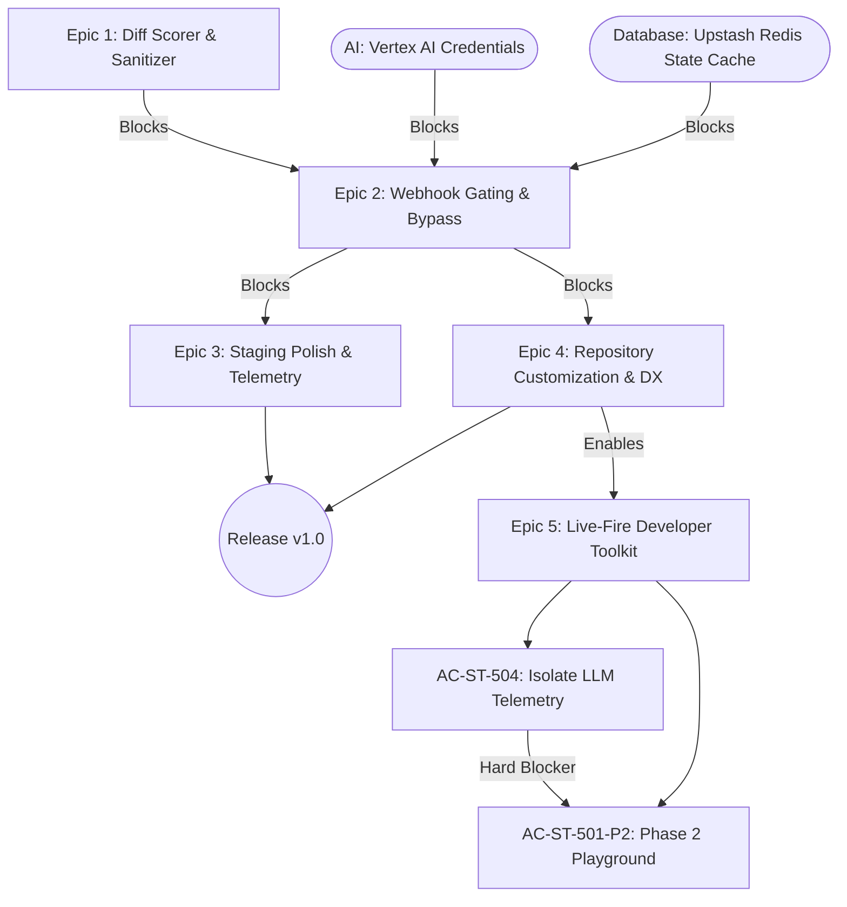

# Master Dependency Register

**Last Updated:** 2026-07-14

**Owner:** Senior Project Manager

## 🗺️ Dependency Map (Critical Path)

## 🔗 Active Dependencies

| Dep ID | Type (Internal/External/AI) | Description & Impact | Blocked Item (Story/Epic) | Blocking Item / Owner | Target Resolution Date | Status (Open/At Risk/Resolved) | Date Logged / Updated |
| :---- | :---- | :---- | :---- | :---- | :---- | :---- | :---- |
| **DEP-01** | External | Upstash Redis connection setup for persistence of PR Quiz states. | Epic 2: Webhook Gating | Upstash REST Database / Tech Lead | 2026-07-07 | Resolved | 2026-07-06 |
| **DEP-02** | AI | Google Cloud Vertex AI credentials authentication JSON. | Epic 1: Diff Scorer | Vertex API Access / AI Engineer | 2026-07-07 | Resolved | 2026-07-06 |
| **DEP-03** | External | GitHub App permission token exchange for comment posting. | Epic 2: Webhook Gating | GitHub Developer Settings / PM | 2026-07-07 | Resolved | 2026-07-06 |
| **DEP-04** | AI | Defensive Prompt-Injection Prompt Specifications approval. | Epic 1: Diff Scorer | Prompt Specifications / QA Lead | 2026-07-08 | Resolved | 2026-07-08 |
| **DEP-05** | Internal / AI | Telemetry collection logs and Redis budget cap triggers. | Epic 3: Staging Polish | State telemetry audit / Tech Lead | 2026-07-15 | Open | 2026-07-09 |
| **DEP-06** | External | Dedicated E2E QA Bot credentials (storageState JSON, user/pass, TOTP secret) | Epic 4: Playwright E2E | GitHub Secrets / PM | 2026-07-10 | Resolved | 2026-07-10 |
| **DEP-07** | External | Dedicated QA GitHub App instance with dynamic webhook configurations | Epic 4: Playwright E2E | GitHub Dev Settings / Tech Lead | 2026-07-10 | Resolved | 2026-07-10 |
| **DEP-08** | Internal | Next.js Middleware edge path blocking configuration | AC-ST-501 Playground | Routing Architecture / Tech Lead | 2026-07-12 | Resolved | 2026-07-14 |
| **DEP-09** | External | Gemini countTokens free-tier online validation request payload compatibility | AC-ST-503 BYOK | Google AI SDK / AI Lead | 2026-07-12 | Resolved | 2026-07-14 |
| **DEP-10** | Internal | AC-ST-504 (`validateAnswers` return type update) must merge before evaluate endpoint (`POST /api/playground/evaluate`) can be built. | AC-ST-501-P2 Task 5.1.2 (Evaluate Route) | AC-ST-504 / Tech Lead | 2026-07-14 | Resolved | 2026-07-14 |
| **DEP-11** | Internal | Phase 1 schema breaking change (token split from `tokenCost` string to `tokens: { input, output, total }`) must complete before Phase 2 UI receipt display can be built. | AC-ST-501-P2 Task 5.1.4 (Two-Stage UI) | AC-ST-501-P2 Task 5.1.1b / Tech Lead | 2026-07-13 | Resolved | 2026-07-14 |
| **DEP-12** | Internal | `src/schema/quiz.ts` shared schema file must be created before both the evaluate route and the fixture Zod validation can import it. | AC-ST-501-P2 Tasks 5.1.2 and 5.1.3 | AC-ST-501-P2 Task 5.1.1a / Tech Lead | 2026-07-13 | Resolved | 2026-07-14 |

## 🤖 AI & Agentic Blockers

*Note: This section specifically tracks dependencies related to Generative AI infrastructure.*

* **Model Availability:** Standard Google Gemini API rate limits (429) can delay high-concurrency PR evaluations. *Mitigated by standard exponential backoff retries and fail-open default circuit breakers.*
* **Data Pipelines:** State tracking is dependent on Upstash Redis Cache REST APIs. *Mitigated by timing-safe fail-opens that auto-approve gates if connection times out.*
* **Prompt Approvals:** Master Prompt specifications with `[SECURITY INSTRUCTION]` parameters for prompt injection defenses have been approved via ADR-008.

## 🚨 Escalation Path

* **Trigger:** If a dependency breaches its Target Resolution Date by 48 hours.
* **Action:** Flag in the [/docs/PM/RAID_log.md](file:///Users/tinhct/Documents/AI%20Projects/ArchiCheck%20Project/archi-check/docs/PM/RAID_log.md) and alert the Tech Lead.
