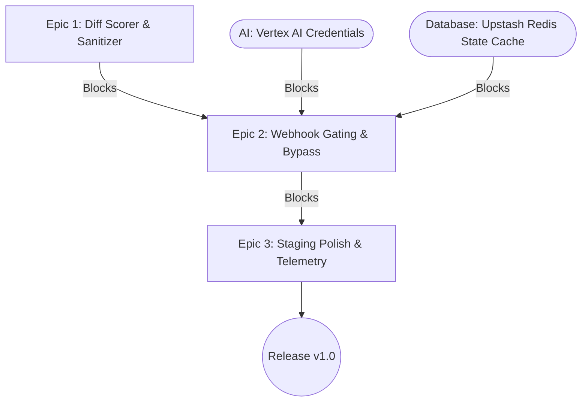

# Master Dependency Register

**Last Updated:** 2026-07-08

**Owner:** Senior Project Manager

## 🗺️ Dependency Map (Critical Path)

## 🔗 Active Dependencies

| Dep ID | Type (Internal/External/AI) | Description & Impact | Blocked Item (Story/Epic) | Blocking Item / Owner | Target Resolution Date | Status (Open/At Risk/Resolved) |
| :---- | :---- | :---- | :---- | :---- | :---- | :---- |
| **DEP-01** | External | Upstash Redis connection setup for persistence of PR Quiz states. | Epic 2: Webhook Gating | Upstash REST Database / Tech Lead | 2026-07-07 | Resolved |
| **DEP-02** | AI | Google Cloud Vertex AI credentials authentication JSON. | Epic 1: Diff Scorer | Vertex API Access / AI Engineer | 2026-07-07 | Resolved |
| **DEP-03** | External | GitHub App permission token exchange for comment posting. | Epic 2: Webhook Gating | GitHub Developer Settings / PM | 2026-07-07 | Resolved |
| **DEP-04** | AI | Defensive Prompt-Injection Prompt Specifications approval. | Epic 1: Diff Scorer | Prompt Specifications / QA Lead | 2026-07-08 | Resolved |
| **DEP-05** | Internal / AI | Telemetry collection logs and Redis budget cap triggers. | Epic 3: Staging Polish | State telemetry audit / Tech Lead | 2026-07-15 | Open |

## 🤖 AI & Agentic Blockers

*Note: This section specifically tracks dependencies related to Generative AI infrastructure.*

* **Model Availability:** Standard Google Gemini API rate limits (429) can delay high-concurrency PR evaluations. *Mitigated by standard exponential backoff retries and fail-open default circuit breakers.*
* **Data Pipelines:** State tracking is dependent on Upstash Redis Cache REST APIs. *Mitigated by timing-safe fail-opens that auto-approve gates if connection times out.*
* **Prompt Approvals:** Master Prompt specifications with `[SECURITY INSTRUCTION]` parameters for prompt injection defenses have been approved via ADR-008.

## 🚨 Escalation Path

* **Trigger:** If a dependency breaches its Target Resolution Date by 48 hours.
* **Action:** Flag in the [/docs/PM/RAID_log.md](file:///Users/tinhct/Documents/AI%20Projects/ArchiCheck%20Project/archi-check/docs/PM/RAID_log.md) and alert the Tech Lead.
