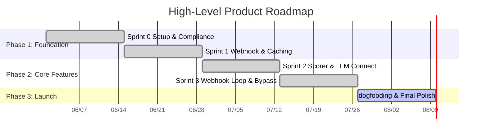

# Product Roadmap

**Last Updated:** 2026-07-07

## 🎯 Product Vision
ArchiCheck serves as a cognitive safeguard for software teams. It detects when developers may be "rubber-stamping" complex AI-generated changes, and gates pull requests behind interactive, language-agnostic architectural comprehension quizzes to keep engineering intuition active, preserve accountability, and protect long-term system integrity.

## 🗺️ Roadmap Visualization

## 📍 Milestones & Deliverables

| Milestone | Target Date | Status (Done/Active/Pending) | Key Epics / Features |
| :---- | :---- | :---- | :---- |
| **M1: Baseline Infrastructure** | 2026-06-29 | Done | GitHub App registration, HMAC verify, Upstash Redis caching. |
| **M2: Complexity Scorer & Sanitizer** | 2026-07-13 | Done | Diff parsing rules, lookbehind secret scrubber, ReDoS circuit breakers, Vertex AI dynamic SDK factory. |
| **M3: Webhook loop & Gate Control** | 2026-07-27 | Done | Lock early commit checks, markdown quiz generator, blockquote reply parser, admin `/archicheck bypass` slash commands. |
| **M4: Production Dogfooding** | 2026-08-10 | Active | Dogfooding pilots with EU & Vietnam Beta cohorts, telemetry audits, and performance tuning. |

## 📈 Current Focus & Next Steps

* **Currently Building:** Running end-to-end webhook simulations on our staging repository to validate the gate lock and bypass commands, while auditing token consumption logs against our $200 sprint limit.
* **Up Next:** Preparing documentation and billing alerts on Vertex AI for the initial Alpha pilot launch with Vietnam and EU developer cohorts.
* **Key Blockers/Risks:** None currently active. All historical ReDoS vulnerabilities, CI path caching blockages, and credential leaks have been fully mitigated and verified green.
