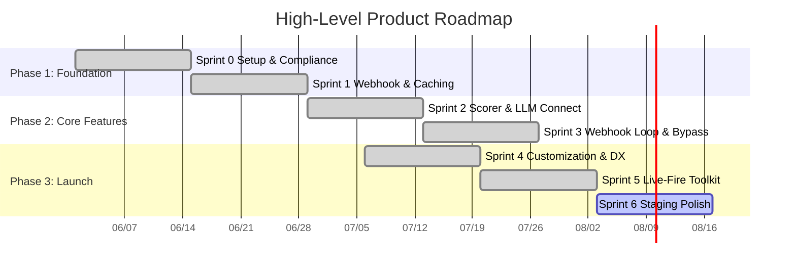

# Product Roadmap

**Last Updated:** 2026-07-12

## 🎯 Product Vision
ArchiCheck serves as a cognitive safeguard for software teams. It detects when developers may be "rubber-stamping" complex AI-generated changes, and gates pull requests behind interactive, language-agnostic architectural comprehension quizzes to keep engineering intuition active, preserve accountability, and protect long-term system integrity.

## 🗺️ Roadmap Visualization

## 📍 Milestones & Deliverables

| Milestone | Target Date | Status (Done/Active/Pending) | Key Epics / Features |
| :---- | :---- | :---- | :---- |
| **M1: Baseline Infrastructure** | 2026-06-29 | Done | GitHub App registration, HMAC verify, Upstash Redis caching. |
| **M2: Scorer & Webhook Gate** | 2026-07-13 | Done | Diff parsing, secret scrubber, ReDoS watchdogs, Pending checks, quiz comment, Admin bypass. |
| **M3: Sandbox & Customization** | 2026-07-10 | Done | Local mock LLM sandbox, config `.archicheck.yml` parser, Playwright E2E GitHub simulation. |
| **M4: Live-Fire Developer Toolkit** | 2026-07-12 | Done | Shadow Mode, BYOK Setup Wizard, Local AI Playground Phase 1 & Phase 2 (two-stage evaluation pipeline, Pipeline Thread UI). |
| **M5: Production Dogfooding** | 2026-08-10 | Active | Dogfooding pilots with EU & Vietnam Beta cohorts, telemetry logs audits, and budget cap alarms. |

## 📈 Current Focus & Next Steps

* **Currently Completed (Sprint 5):** Full "Live-Fire" Developer Toolkit (Epic 05) — Local AI Playground Phase 1 & Phase 2 (two-stage evaluation pipeline with per-question inline reply boxes, discriminated union response schema, fixture system), Shadow Mode with offline InMemoryCache and live GitHub App testing support, BYOK CLI wizard, Pipeline Thread UI redesign (AC-ST-505). All 17 backlog stories are Done (100% completion).
* **Up Next (Sprint 6):** AC-ST-302 Token Burn Telemetry Alerting (budget cap alarms for Vercel execution streams). AC-ST-301 Pilot Onboarding & Cohort Configuration (regional developer Alpha trials for Vietnam and EU).
* **Key Blockers/Risks:** None currently active. All Sprint 5 implementation validated with 97/97 tests green, TypeScript clean.
