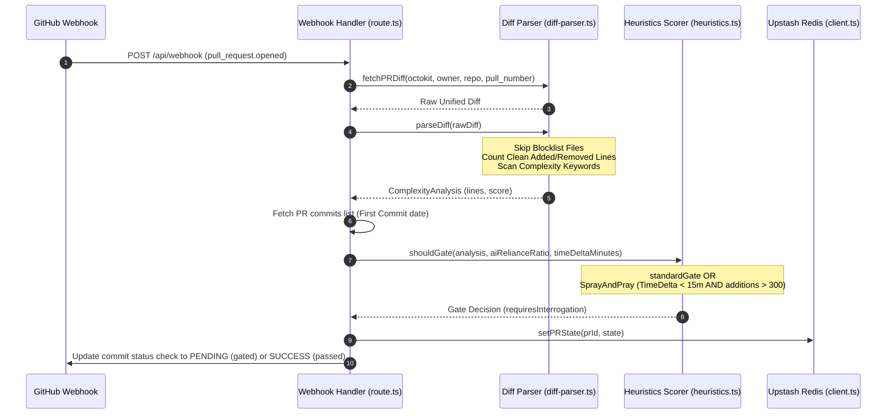

# Feature Name
Diff Complexity Extraction & Heuristics (Story 2.1)

# Business Context & Value
As development organizations integrate autonomous AI software agents into their pipelines, developers face the risk of "cognitive offloading" and passive merging (rubber-stamping) of code changes. This feature quantifies the structural volume and cognitive complexity of pull request additions, evaluating them against specific thresholds and developer velocity metrics. If changes are highly complex or written suspiciously fast (the "Spray and Pray" velocity pattern), the system blocks the merge and gates the PR behind interactive architectural quiz validations to ensure human comprehension.

# Architecture Diagram


# Architecture & Components
* **GitHub Integration Services** ([auth.ts](../../src/lib/github/auth.ts), [route.ts](../../src/app/api/webhook/route.ts)): Resolves installation-scoped Octokit clients, fetches the raw unified diff, retrieves the commits list, and triggers status checkpoints.
* **Diff Parser Service** ([diff-parser.ts](../../src/lib/analyzer/diff-parser.ts)): Filters out blocklisted files, splits the patch into file hunks, and counts lines added/removed and complexity keywords on clean additions.
* **Heuristics Scorer Service** ([heuristics.ts](../../src/lib/analyzer/heuristics.ts)): Computes complexity scores and implements gating thresholds including the "First Commit Proxy" velocity rules.

# Data Model Changes
* **ComplexityAnalysis** structure updated to include standard verification keys:
  ```typescript
  export interface ComplexityAnalysis {
    score: number;
    linesAdded: number;
    linesRemoved: number;
    isAgentic: boolean;
    confidence: number;
  }
  ```

# Agent Implementation Steps
* **Phase 1:** Refactor parser and heuristics files with helper interfaces and blocklist rules.
* **Phase 2:** Implement diff parser line iteration, blocklist file exclusions, and complexity scorer formulas.
* **Phase 3:** Integrate first-commit velocity timestamp calculations in `/api/webhook` and verify through Vitest integration suites.

# Security & Performance Risks
* **CPU and Memory Overhead**: Parsing massive unified diffs inside serverless Next.js edge functions can trigger memory exhaustion or timeout thresholds. Mitigated by applying file blocklists and enforcing a 1,500-line hard ceiling circuit breaker.
* **GitHub Rate Limits**: Querying Git commit histories consumes API requests. Mitigated by using a single lightweight commits query (`GET /pulls/{number}/commits`) to retrieve the first commit instead of polling git branch ref events.

# Acceptance Criteria
* Retrieves raw unified diff text from GitHub API utilizing authenticated installation clients.
* Excludes package manager lockfiles, minified distribution files, assets, and markdown docs from complexity calculations.
* Triggers a gate interrogation (`requires_interrogation = true`) if:
  * Complexity score $\ge$ configured threshold AND AI reliance $\ge$ reliance threshold.
  * TimeDelta between first commit and PR creation $<$ 15 minutes AND functional lines added $>$ 300 (Velocity check).
