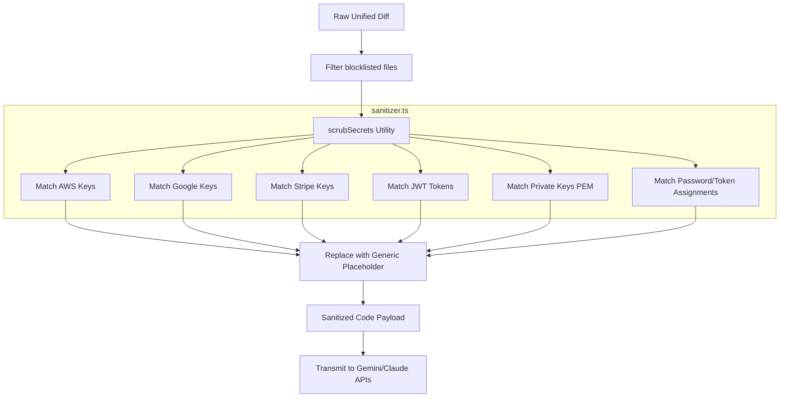

# Feature Name
Payload Sanitization & Secret Scrubbing (Story 2.2)

# Business Context & Value
ArchiCheck integrates with external third-party LLM APIs (like Anthropic Claude or Google Gemini) to generate interactive architectural quizzes. To comply with enterprise privacy policies, data governance regulations, and security best practices, we must absolutely guarantee that no proprietary secrets, API keys, private credentials, or credentials embedded within developer diffs are leaked to external APIs. The sanitization pipeline scrubs sensitive patterns before any payload is compiled or transmitted.

# Architecture Diagram

# Architecture & Components
* **Sanitization Utility** ([sanitizer.ts](../../src/lib/security/sanitizer.ts)): Core regular expression matching engine.
* **Fixture Test Suite** ([sanitizer.test.ts](../../tests/unit/sanitizer.test.ts)): Unit tests verifying that various credential signatures are redacted correctly.

# Data Model Changes
* None. Operates directly on string values.

# Agent Implementation Steps
* **Phase 1:** Identify common secret regex patterns (AWS, Google APIs, Stripe, JWT, PEM blocks, property assignments).
* **Phase 2:** Implement sequential regex replacements. Utilize a negative lookahead on assignment checks to prevent double-redaction on already scrubbed values.
* **Phase 3:** Write comprehensive unit test fixtures to check against multiple edge cases.

# Security & Performance Risks
* **Regex ReDoS (Regular Expression Denial of Service)**: Untrusted, large user diff inputs can cause exponential backtracking on poorly written regex expressions. Mitigated by using simple, linear-time regular expressions and avoiding nested quantifiers.
* **Diff Structure Corruption**: Replacing code segments must not break unified diff formatting or hunk offsets, which would make it difficult for the LLM to identify files. Mitigated by using precise, inline replacements that preserve spacing and line boundaries.

# Acceptance Criteria
* Correctly replaces AWS Access Keys, Google API keys, Stripe API keys, JWTs, and private PEM certificate blocks.
* Uses generic placeholders like `[REDACTED_SECRET]` (or typed indicators like `[REDACTED JWT]`).
* Utilizes a lookahead guard to prevent double-redacting already redacted strings.
* Does not corrupt surrounding diff syntax (line boundaries, hunk indentation, git metadata).
