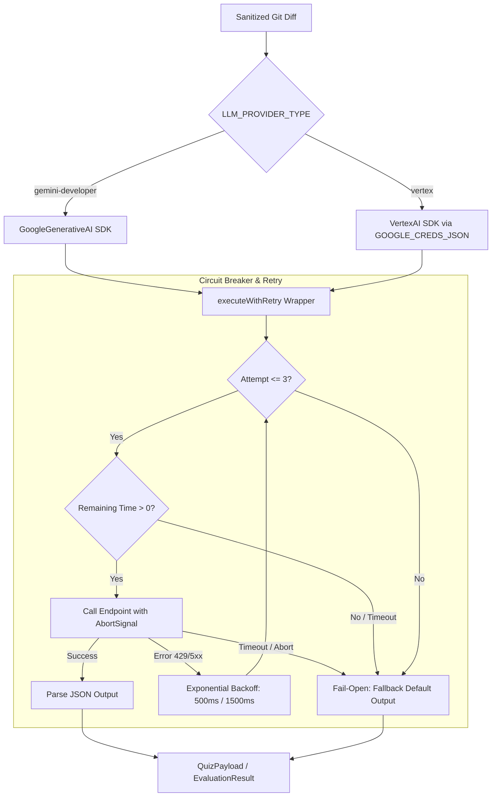

# Feature Name
Secure LLM API Connection & Prompting (Story 2.3)

# Business Context & Value
To generate interactive, high-value architectural quizzes and evaluate developer answers, ArchiCheck connects to frontier LLM APIs (Gemini 1.5 Pro and Claude 3.5 Sonnet). This feature ensures that connections are establishable securely, comply with enterprise zero-data-retention training mandates, and are resilient to LLM latency or service outages. By implementing factory patterns, we decouple OSS developer key configurations from our internal enterprise GCP Vertex AI deployments.

# Architecture Diagram

# Architecture & Components
* **LLM Provider Factory** ([provider.ts](../../src/lib/llm/provider.ts)): Routes API calls between standard Gemini developer endpoints and enterprise Vertex AI endpoints based on dynamic env switches.
* **Environment Validation** ([env.ts](../../src/config/env.ts)): Ensures `GOOGLE_CREDS_JSON` is strictly required at startup if `LLM_PROVIDER_TYPE` is set to `vertex`.
* **System Prompt Templates** ([prompts.ts](../../src/lib/llm/prompts.ts)): Defines versioned prompting templates that direct the LLM to output structured JSON responses conforming to architectural standards.
* **JSON Schema Enforcement** ([schema.ts](../../src/lib/llm/schema.ts)): Declares Zod schemas (`quizPayloadSchema`, `evaluationResponseSchema`) to validate structured LLM inputs and outputs.

# Data Model Changes
* Environment variable validation rules added to [env.ts](../../src/config/env.ts):
  * `LLM_PROVIDER_TYPE`: `gemini-developer` | `vertex` (default: `gemini-developer`)
  * `GOOGLE_CREDS_JSON`: service account credentials JSON string (required when type is `vertex`)

# Agent Implementation Steps
* **Phase 1:** Install official `@google/generative-ai` and `@google-cloud/vertexai` SDK dependencies.
* **Phase 2:** Update environment Zod schemas to conditionally require service account JSON credentials under `vertex` selection.
* **Phase 3:** Refactor `provider.ts` to implement the dynamic factory, structured outputs, a 15-second total timeout using `AbortController`, and exponential backoff retry parameters. Verify via mock prototype spies in Vitest.

# Security & Performance Risks
* **Data Ingestion/Training Leakage**: Transmitting proprietary code to standard LLM endpoints. Mitigated by using Google Vertex AI enterprise endpoints with strict zero-data-retention terms for hosting, and setting Claude headers (`anthropic-beta: prompt-caching-2024-07-31`) to guarantee privacy.
* **LLM Availability / Webhook Timeouts**: LLM API latency can easily exceed GitHub's 5-second or 15-second limits, freezing webhooks. Mitigated by:
  1. **15-Second Hard Limit**: Aborting the HTTP request cleanly if it exceeds 15 seconds.
  2. **Fail-Open Gating**: Returning safe, pre-approved fallback JSON values so the PR build pipeline proceeds immediately without blocking developers.
  3. **Transient Retry Delay**: Executing up to 2 retry attempts on transient `429` (rate limit) or `5xx` (server errors) with 500ms/1500ms backoff intervals.

# Acceptance Criteria
* Dynamically toggles between Google Generative AI Developer API and enterprise-grade Vertex AI.
* Generates quizzes and evaluations as valid JSON matching our Zod schema structured output specifications.
* Outputs token usage logs in JSON format for consumption monitoring.
* Aborts connections and fails-open if total execution exceeds 15 seconds.
* Automatically retries on rate limits (`429`) or server failures (`5xx`) up to 2 times within the remaining SLA time window.
